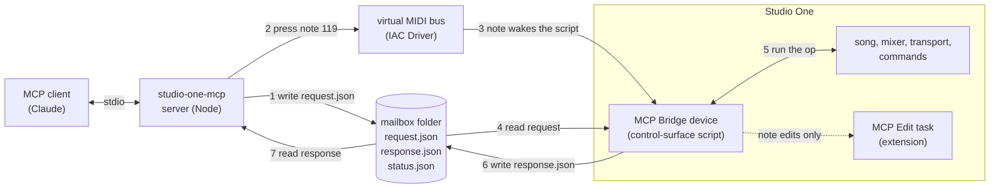
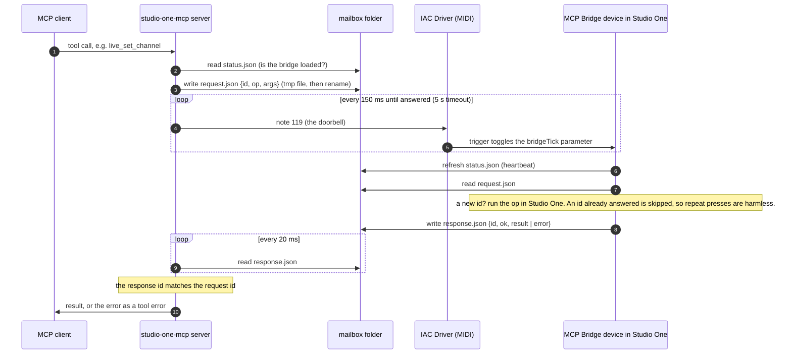

# studio-one-mcp

> **This fork** (Windows + composition): tested on Windows 11 with Studio One 7.2.3. On Windows the doorbell is a [loopMIDI](https://www.tobias-erichsen.de/software/loopmidi.html) port named `studio-one-mcp` (the default). Adds `live_create_part`, `live_write_notes`, `live_write_chords` and `live_write_drums`, and `live_edit_notes` can now add the first notes to an empty part. Based on [NeanderthalMan/studio-one-mcp](https://github.com/NeanderthalMan/studio-one-mcp) (MIT).

An [MCP](https://modelcontextprotocol.io) server for PreSonus **Studio One**. It lets Claude and other MCP clients read your songs and control a running Studio One.

Studio One has no public API, no OSC, and no network scripting. This server combines two things it *does* have:

| Layer | How | Needs Studio One running? |
|---|---|---|
| **`song_*` tools** | Parse `.song` files, which are zip archives of XML: tempo map, meter, markers, arranger sections, tracks, takes, clips, mixer, plug-in inserts and media. | No. Reflects the last save or autosave. |
| **`live_*` tools** | A small control-surface device, installed into Studio One, that answers requests through a local **file mailbox**. It uses Studio One's own JavaScript device SDK. | Yes |

Status: early. Upstream was developed against **Studio One 5.5.2 on macOS** and says the paths for Windows and for Studio One 6/7 and Studio Pro 8 are wired in but untested. This fork has been tested on Windows 11 with Studio One 7.2.3.

An independent project, not affiliated with or endorsed by PreSonus or Fender. Studio One is their trademark.

## Tools

| Tool | What it does |
|---|---|
| `song_list` | Songs on disk, newest first. This includes songs that exist only as autosaves. |
| `song_read` | One song, as a `summary` (one line per track) or `full` (every take and clip, instrument notes, each plug-in's saved settings, automation envelopes). Both include the song notes and channel notes when there are any. Positions are given as bar/beat and as seconds. |
| `song_history` | A song's autosaves, for comparing versions. |
| `song_diff` | What changed between two saves: tempo, meter, markers, sections, tracks (added, removed, renamed, takes, events, notes), mixer (levels, mute/solo, automation mode, output, plug-ins and their settings) and automation. By default it compares the song with its newest autosave, older to newer. |
| `live_status` | Whether the bridge is reachable. If not, it says why. |
| `live_song` | The open song as it is right now, unsaved changes included: title, file path, transport (playing, recording, loop, position, tempo, loop range, precount, preroll), track count, selected tracks. |
| `live_tracks` | Tracks with media type, colour, mixer channel, number of takes, selection, and events (name, start, end, length in seconds, muted). |
| `live_select_track` | Select a track by name, so that selection-based commands act on it. |
| `live_transport` | Press a transport button: play, stop, record, return to zero, rewind or forward a bar, go to the loop start or end, toggle loop, click, precount or preroll. |
| `live_set_transport` | Set the tempo, the playhead position (in seconds, or bars like `"9.1.1.0"`), and loop, precount or preroll on or off. |
| `live_markers` | Markers with number, position (seconds and bars) and name (live, from the marker track). Reading them briefly moves the playhead and puts it back, so it refuses while playing. Studio One only has recall commands for markers 1 to 20. |
| `live_add_marker` / `live_delete_marker` / `live_rename_marker` | Add a marker at a position (seconds or bars), optionally named; delete one by number or position; rename one by number or name. The playhead is left where it was. |
| `live_select_events` | Select every event on some tracks or on all of them, or clear the selection. Selection-based commands then act on those events, e.g. `Event/Mute Events`, `Edit/Split at Cursor`, `Event/Quantize`, `Track/Activate Next Layer` (switch takes), `Edit/Undo`. |
| `live_set_loop` | Set the loop range in seconds or bars (e.g. `"9.1.1.0"` to `"17.1.1.0"`), and turn looping on or off. |
| `live_takes` | A track's takes: list them (with names from the last save), switch to the next or previous take or to take N, add an empty take or duplicate the active one, unpack them to separate tracks, or recall a retrospective recording. |
| `live_track_state` | Arm, monitor, mute, solo, hide or duplicate a track by name, or show all tracks. |
| `live_edit_events` | Clip edits on one track: mute or unmute, quantize, transpose, split or trim at a time, merge, delete. |
| `live_events` | One event on a track, by number (in time order) or name: list them (with gain and fades for audio), **edit** it (move to a position, move to another track, set or add gain in dB, fade in and out) as one undo step, **duplicate** it N times, or **copy** it to a position on any track (through the clipboard). |
| `live_add_track` | Add an audio (mono or stereo), instrument, folder or automation track. |
| `live_meters` | Peak dB for every channel. With `duration_ms`, it samples during playback and reports the highest peak and any clipping. |
| `live_save`, `live_undo`, `live_redo` | Save (optionally as a new version), and undo or redo edits, with a step count. Check the result rather than counting undo steps: see [Undo](#undo). |
| `live_plugins` / `live_add_plugin` | The installed plug-ins by name (PreSonus, VST and AU): effects, or instruments with `kind: "instrument"`. Add an effect to a channel's inserts by name; one undo removes it. |
| `live_add_send` | Add an effect send: Studio One makes a new FX channel with the plug-in and a send to it (a reverb or delay send). Sending to an existing bus is not reachable from scripts, and this is not reliably undone. |
| `live_add_instrument_track` | Add an instrument track with a new instance of an instrument by name (Mai Tai, Presence…). One undo removes both. |
| `live_create_part` | Create an empty instrument part on an instrument track from a bar for N bars (4/4), restoring the loop range and selection; one undo removes it. |
| `live_write_notes` | Write notes (MIDI numbers or names like `C3`, middle C = C3) on an instrument track from a bar, making a part to cover them if there is none; one undo per call. |
| `live_write_chords` | Write a chord progression like `Cm7 \| Ab \| Eb Bb` with voicing (close, open, drop2) and rhythm (sustain, quarters, eighths, arpeggios) from a bar; one undo per call. |
| `live_write_drums` | Write a drum pattern from one `x`/`X`/`.` string per General MIDI lane (kick, snare, hat...) from a bar, repeated for N bars; one undo per call. |
| `live_inserts` / `live_bypass_insert` | Plug-ins on each channel (slot, name, bypassed), and bypass one slot or the whole rack. |
| `live_sends` / `live_set_send` | Each channel's sends (destination name, level 0..1 and in dB, mute), and set a level or mute. |
| `live_plugin_params` / `live_set_plugin_param` | A plug-in's parameters (value, display text like `"2.0:1"`, range, normalised value), and set one by display text, normalised value or raw value. Studio One cannot list a plug-in's parameters, so names come from its presets and Studio One's remote-control map, which covers the PreSonus plug-ins. For other plug-ins, pass the names. |
| `live_mix_snapshot` | Save the whole mix under a name (every channel's volume, pan, mute, solo, monitoring and send levels, per song), restore it later, or list them. Restore sets only what differs. Record-arm and automation mode are not included. |
| `live_plugin_snapshot` | Save a plug-in's current settings under a name, and restore them onto the same kind of plug-in on any channel. A stand-in for presets: Studio One's preset commands act on the focused editor window and store through dialogs. |
| `live_record_setup` | Read and set the metronome (click, precount and its length in bars, preroll), and set record modes (replace, loop takes or mix, takes to layers, input quantize, note erase). Studio One does not expose record modes for reading, so those are reported as set, not confirmed. Auto Punch: off, in, out or both, with a punch range (Studio One punches between the loop locators; looping is not switched on). |
| `live_set_automation` | Set a channel's automation mode: off, read, touch, latch or write. `live_channels` shows each channel's mode. |
| `live_write_automation` | Write volume (in dB) or pan automation along points, straight lines between them. Scripts cannot add envelope points, so it plays the range once in Write mode with the fader following the curve, then leaves the channel in Read. Audible, and only with `confirm: true`. |
| `live_arranger` | Arranger sections: list them (live), go to one by number or name (a jump at the sync point while playing, a playhead move while stopped), step next or previous while playing, set the sync mode, create sections from markers, and **add, rename, resize, move or remove** a section (each one undo; the events under a section are not moved). With its content on every track: **copy** a section in at a position (what follows moves later), **delete** it and close the gap, or **move** it (`content: true`). The loop range is kept. |
| `live_macros` / `live_run_macro` | The macros (built-in and your own) by title, and run one by title, or only check whether it is enabled. |
| `live_time_signature` | The time signature at any positions; insert one at a bar, or remove one. Each is one undo. |
| `live_tempo` | The tempo at any positions, set the tempo of the segment containing a position, or insert a tempo change. Studio One must be stopped; the playhead is put back. Removing an inserted change takes undo, so check with `at` afterwards. |
| `live_notes` | Notes in an instrument track's parts: pitch (number and name, middle C = C3), velocity 0 to 127, start, end and length in seconds, start in beats. Read-only. |
| `live_edit_notes` | Edit an instrument track's notes: transpose, set or change velocity, move, change length, quantize (to a grid like `1/16`, `1/8T` or `1/8.`, with a strength), delete (with a filter), add notes. Filters by pitch and beat range. Runs through a small edit-task extension installed with the device, so no dialog opens, and Studio One's own quantize setting is left alone. |
| `live_track_edit` | By track name: rename, recolour (`"#rrggbb"`), remove, **move** it before or after another track, **route** its output to a bus or output, move it into a **folder** (creating the folder if asked), or **rename its events** (numbered in time order if asked). Rename and colour are not on the undo stack; route is set back with the "before" value it returns; remove, move, folder and event renames undo. Move, route, folder and event renames run through the **MCP Track Edit** task in the extension. |
| `live_bounce` | Bounce all events on a track, in place or to a new track (the originals are muted), without dialogs. One undo reverts it; the rendered file stays in the song's Bounces folder. Mixdown and stem export open dialogs, so they are not offered. |
| `live_record` | Record, which writes a take into the song. Only runs with `confirm: true`. It can arm a track first, start from a position, set precount, and stop after N seconds. |
| `live_channels` | Live mixer: volume, pan, mute, solo, record-arm, input monitoring, automation mode, and routing (input and output by name) for each channel. To change a track's output, use `live_track_edit` with `route`. |
| `live_set_channel` | Set volume, pan, mute, solo, record-arm or input monitoring on a channel. |
| `live_add_bus` | Create a bus for some tracks (their outputs are routed into it) or a VCA that controls them. One undo removes it and puts the routing back. |
| `live_command` | Run any of the roughly 1,000 Studio One commands, e.g. `Transport/Start`, `Edit/Undo`, `File/Save` or `View/Console`. `check_only` reports whether one is enabled without running it. |
| `live_list_commands` | Discover command names, optionally with whether each is enabled right now. |
| `live_changes` | What changed in the song since the previous call: tracks added, removed, renamed or reordered, events on each track, mixer changes (levels, mute and solo, arm, monitor, automation mode, output, plug-ins), tempo, loop, markers and sections. It compares snapshots, so it sees what you did by hand as well, as net changes. |
| `live_eval` | Run JavaScript inside Studio One to explore its object model. Opt-in only. |

## Install

You need Node.js 20 or newer and Studio One.

```sh
npx -y studio-one-mcp setup
```

That is the whole install: npm fetches the package and the guided setup below takes it from there. To work on the code instead, clone it and run setup from the checkout, which then registers that checkout:

```sh
git clone https://github.com/NeanderthalMan/studio-one-mcp.git
cd studio-one-mcp
npm install
npx studio-one-mcp setup
```

`setup` walks you through each step and asks before changing anything:

1. It finds your Studio One user profile.
2. It installs the **MCP Bridge** device into it, and a small extension (`Extensions/studio-one-mcp.edittasks`) that lets the bridge edit notes.
3. It checks for a virtual MIDI port, which acts as the bridge's doorbell:
   - **macOS:** the built-in IAC Driver. `setup` can open Audio MIDI Setup for you. Tick **Device is online** under **IAC Driver**.
   - **Windows:** install [loopMIDI](https://www.tobias-erichsen.de/software/loopmidi.html) and add a port named `studio-one-mcp`.
4. It registers the server with Claude Code (all projects) and, if you want, Claude Desktop. Installed with `npx`, it registers `npx -y studio-one-mcp@<this version>`, pinned so the server always matches the device it installed; from a clone, it registers that checkout. It backs up the Desktop config before editing it. For any other client, it prints the JSON to paste.
5. It shows the one step you do in Studio One: **Preferences… (⌘,)** on a Mac, **Options** on Windows → **External Devices → Add… → studio-one-mcp → MCP Bridge**. Set **Receive From** to your virtual MIDI port, and **Send To** to None. Restart Studio One first if it was running.
6. It waits for Studio One to answer.

From a clone, `npm run setup` does the same thing. Use `--yes` to accept the defaults, `--dry-run` to see what it would do, and `--profile <dir>` to pick a profile.

If something doesn't work, run:

```sh
npx -y studio-one-mcp doctor   # from a clone also: npm run doctor
```

It checks every link in the chain and tells you how to fix the first broken one: Node, profile, Songs folder, device installed and current, edit-task extension installed and current, MIDI port, Studio One running, bridge loaded, bridge answering, the edit task loaded in Studio One, and MCP client registration. `setup` treats the device and the extension as one install: if either is missing or out of date (for example after an update), it offers to reinstall both.

To remove the device and the extension: `npx -y studio-one-mcp uninstall`, then remove **MCP Bridge** under External Devices.

To update: `npx -y studio-one-mcp@latest setup`. It reinstalls the device and the extension and registers the new version. From a clone: `git pull`, then `setup` again. Either way, restart Studio One afterwards: it loads the device and the extension only at startup.

**Without the live bridge:** the `song_*` tools need nothing but the MCP registration. They read your `.song` files directly.

### Configuration

| Env var | Default |
|---|---|
| `STUDIO_ONE_SONGS` | `~/Documents/Studio One/Songs` (colon-separated list) |
| `STUDIO_ONE_PROFILE` | newest `…/PreSonus/Studio One *` user folder |
| `STUDIO_ONE_MCP_MIDI_PORT` | first MIDI output whose name contains `IAC` |
| `STUDIO_ONE_MCP_HOME` | `~/Library/Application Support/studio-one-mcp` (the mailbox lives here) |

## How the live bridge works

Studio One runs control-surface scripts in an embedded SpiderMonkey engine. Scripts can read and write files but cannot open sockets, so the bridge is a folder. Studio One 5 also gives scripts no usable timer, so the bridge is event-driven. After writing a request, the server presses MIDI note 119 on a virtual MIDI bus (the macOS IAC Driver). The device's surface file maps that note, as a trigger control, to a toggle on a component parameter, and the component answers on each change.



```
status.json    device → client   session id and heartbeat; refreshed whenever the bridge runs
request.json   client → device   {id, op, args}, written atomically (tmp + rename)
response.json  device → client   {id, ok, result | error}
```

One request, step by step:



The client re-sends the press every 150 ms until a response arrives. The component answers each request id once, and the client sends one request at a time (the mailbox has a single slot).

For note edits (`live_edit_notes`) there is one more hop inside Studio One, described under [Editing notes](#editing-notes): the device writes the operations to `edit-request.json`, runs the **MCP Edit** command, and reads `edit-result.json` before it writes its response.

Two rules for anything that runs inside Studio One, both learned on 5.5.2:

- Never `throw`. An exception raised while Studio One is calling into a script becomes a modal **Scripting Error** dialog, even when the code catches it. While that dialog is open, some edits (mute, solo) silently do not apply. The device scripts return errors as values, and a test enforces it.
- Never call a member of a host object without first checking that it exists. A TypeError on a host object raises the same dialog.
- The same goes for code sent through `live_eval`. A `throw` there popped the dialog in testing, the first time in a session, even though the bridge catches it and reports the error.

### Editing notes

A control-surface script can read notes but not change them. Studio One's own Musical Functions (Transpose, Velocity, Quantize…) are *edit tasks*: scripts that Studio One hands the selected notes and a set of editing functions. studio-one-mcp installs one of its own, **MCP Edit**, as a user extension: a folder in the profile's `Extensions` with a ZIP `.package` inside (a loose `Scripts` folder is not scanned). It shows up as the command `Musical Functions/MCP Edit`. For `live_edit_notes`, the bridge writes the operations to `mailbox/edit-request.json`, selects the track's parts, runs that command, and reads `mailbox/edit-result.json`. The task asks for no dialog, so none opens, and it applies only a fixed set of operations, never code from the mailbox.

The extension carries a second task, **MCP Track Edit** (`Track/MCP Track Edit`), for what a control-surface script cannot change on tracks: routing a channel's output (through the same `connectChannel` that Studio One's "Add Bus for Selected Channels" uses), moving tracks into folders, and renaming events. It works the same way, through `track-edit-request.json` and `track-edit-result.json`, and needs no selection. Its song-structure operations are in `McpTrackOps.js`: track order, instrument tracks, plug-ins and FX sends, single events, arranger sections, markers and time signatures. Everything one run of the task changes is one undo step. Studio One reads the package each time the task runs, so a reinstall takes effect without a restart (the bridge device itself still needs one).

What these found out about Studio One 5.5.2, in short:

- The Marker Track and Arranger Track are the first two tracks the song's own track iterator gives, and their events are the markers and sections, with names. Event times are numbers in each event's own time format (seconds, samples or quarter-note beats), converted through a `MediaTime`.
- A track leaves a folder for the top level right *after* that folder, and a top-level track does not move at all, so reordering goes through a temporary folder made at the target place.
- `DeviceEditFunctions.insertDevice` (what Studio One's own Insert FX task uses) puts plug-ins on the undo stack; the insert folder's own `insertDeviceClass` does not. Into a channel's Sends it makes an FX channel with a send. A send to an existing bus has no scripted route.
- Commands that open a dialog take its values as arguments (`findCommand(...).arguments` lists them, e.g. `Bar, Numerator, Denominator` for Insert Time Signature). Given as **numbers** they run without the dialog; given as strings the dialog opens and blocks the bridge until someone closes it.
- Edit/Paste goes to the editor's focus track, not the selected one; the task focuses the target first.
- There is no scripted way to add automation envelope points, so `live_write_automation` records them the way a person would, in Write mode.
- With an arranger section selected, Edit/Copy takes the section *and* everything under it, and Edit/Paste inserts that at the playhead; Edit/Delete and Cut take only the section. Edit/Delete Time in Loop removes a range from every track, section and marker.

### Watching for changes

`live_changes` takes a snapshot of the song on every call (tracks and their events, the mixer, plug-ins, tempo, loop, markers and sections), keeps it in the studio-one-mcp data folder per song, and reports the difference from the previous one. The first call for a song only takes a look. Changes are net (a fader moved and moved back is no change) and do not say who made them.

Studio One 5.5.2 can also notify scripts of changes (`Host.Signals.advise`), and a live feed built on that was tried and dropped: it crashed Studio One three times. Reading a parameter's text while a song was closing crashed it at once; unsubscribing from an object that was already gone crashed it about a minute later; and unsubscribing while Studio One quit crashed it at quit. A close does send the DocumentManager's `activeDocumentChanged` before tearing the song down, but there is no such notice before quitting, so there is no safe moment to let go. Comparing snapshots touches none of that.

### Undo

Changing a mixer parameter and setting it back (volume, monitor, a plug-in parameter, automation mode) is recorded as one undo step that changes nothing, and it is recorded late, on top of edits made after it. So an Undo right after such a change can remove that invisible step instead of the edit you just made. Check the song after undoing, and undo again until your edit is gone. The live tests do exactly that, and they stop and redo if an undo changes the song's track or channel count unexpectedly.

## Testing

```sh
npm test            # unit and end-to-end tests; no Studio One needed
npm run test:live   # against a running Studio One with the bridge installed
```

The unit tests run the real device scripts and the edit task under `node:vm` against a fake Studio One host (`test/helpers/s1host.js`). The live tests change only what they restore, and check the song afterwards (tracks, channels and the track selection are compared at the end of the run). They never record, save or bounce.

- Set and set back: one channel's mute, solo, volume, monitor and automation mode; a plug-in parameter (directly and through a snapshot); a send level; the metronome's click and precount length; the tempo, playhead and loop; takes (next/previous and go-to).
- Edits that are then undone: a split, an added track, an added and duplicated take, a bus, and note edits (a transpose, a velocity and a quantize) through the edit task; a track moved, a plug-in added, an instrument track added, an event moved with gain and a fade, an event copied, a section added and renamed, a named marker added and renamed. Undo runs until the edit is gone (see [Undo](#undo)).
- A time signature inserted at bar 9 and removed again.
- Not in the live suite: `live_add_send` (not reliably undone) and `live_write_automation` (it plays the song). Both were checked by hand on a scratch song, the automation by saving and reading the envelope back.
- A marker is added at 3.25 s and deleted; a track's events are muted and unmuted; a track is muted and muted again (track mute is not on the undo stack); a scratch track is added, renamed, recoloured and removed.
- Some tests need something in the song and skip without it: a PreSonus plug-in on a channel, a send, a track with takes, an instrument track with notes, and two saved arranger sections.

File/Save is only checked, never run. Record modes and bouncing are not in the live suite: record modes cannot be read back to restore them, and every bounce leaves a file in the song folder.

Security: anything that can write to the mailbox folder, which means anything running as your user, can drive Studio One through it. With `--allow-eval`, it can also run arbitrary script inside Studio One. Keep the folder local, and leave eval off unless you are exploring.

## Format notes (`.song`)

These were verified on songs saved by Studio One 5.5.2:

- Events and markers with `timeFormat="2"` are in **quarter-note beats**. An audio event's `length` equals the clip's `frameCount / sampleRate × bpm / 60`.
- `TempoMapSegment@tempo` is **seconds per quarter note**, so 0.5 means 120 bpm.
- The transport's position and loop points are in **seconds**.
- Mixer `gain` is linear amplitude, and `pan` runs from 0 to 1 with 0.5 as centre.
- A track's takes are `Layers`, and `MediaTrack@activeLayer` picks the one that plays.
- Tracks link to mixer channels through `UID x:id="channelID"`, which matches the channel's `uniqueID`.
- Insert slots are the unnamed `<Attributes name="FXnn">` children of `Inserts`. Siblings with an `x:id` (`Presets`, `Combinator`) are rack state.

## Prior art

- [tiwadara/StudioOneMcp](https://github.com/tiwadara/StudioOneMcp) drives Studio One through MIDI, Mackie Control and UI automation. It is write-only.
- [Alari81/studio-control](https://github.com/Alari81/studio-control) proved the file-mailbox device pattern on Studio Pro 8. It uses a different, noncommercial license, and no code from it is included here.
- [CSources/Studio-Pro-Scripting-API-Reference](https://github.com/CSources/Studio-Pro-Scripting-API-Reference) is a community reference for the scripting API.

Studio One is a trademark of PreSonus Audio Electronics / Fender. This project is not affiliated with either.

## License

MIT
